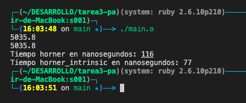

# tarea3-pa
Tarea 3 Programación Avanzada

## Instrucciones de compilacion
```sh
mkdir -p build
g++ -O2 -std=c++11 -mavx main.cpp -o build/main.o 
./build/main.o
```

o
```sh
./build_and_run.sh
```

## Salida de la terminal

